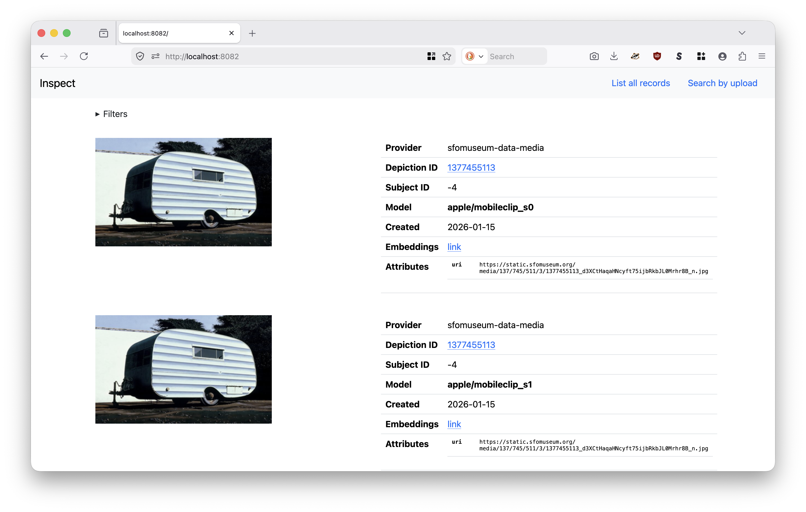
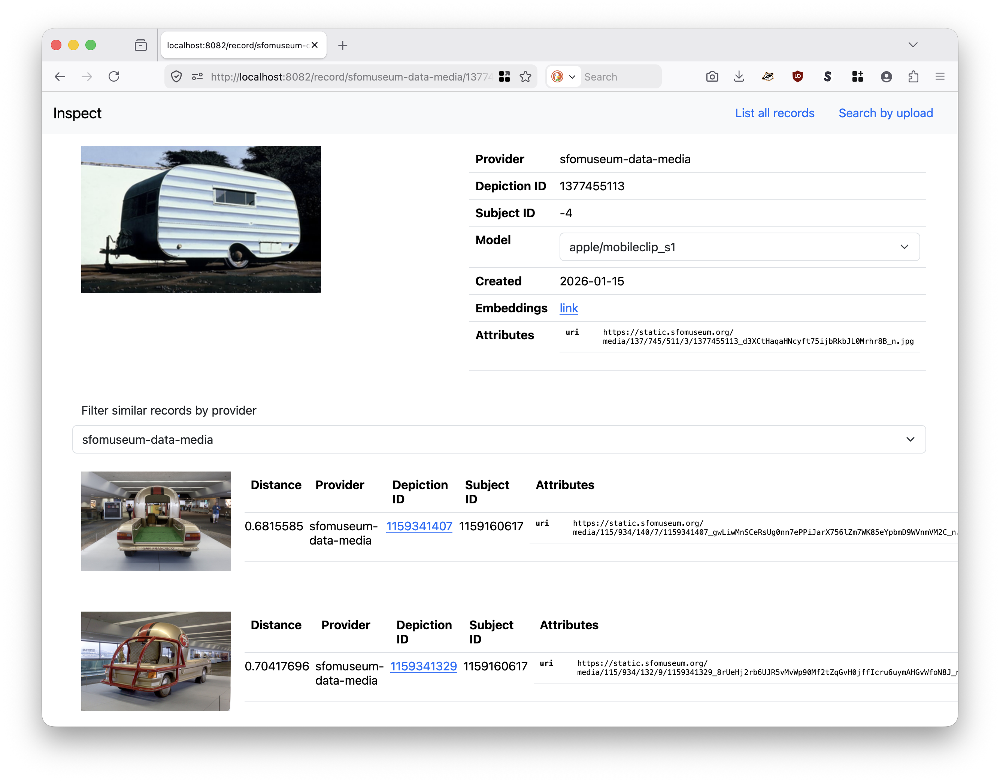
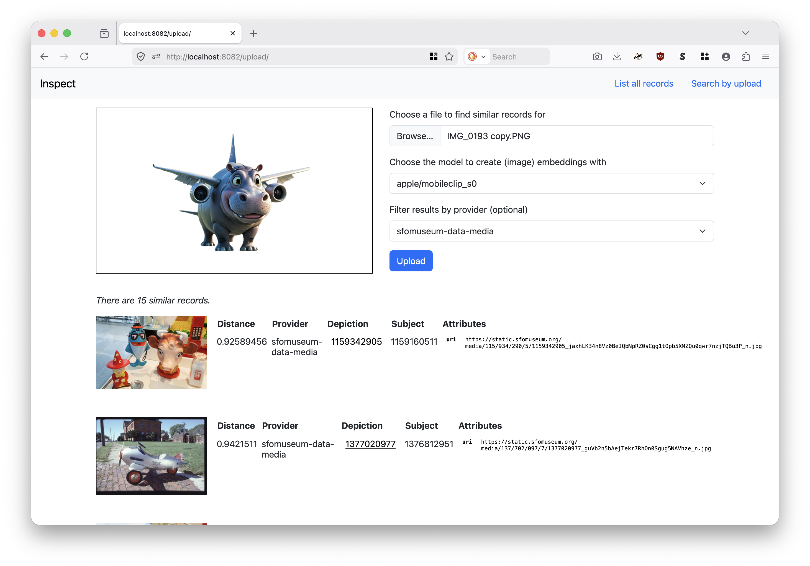

# go-embeddingsdb

An opinionated Go package for storing, indexing and querying vector embeddings.

## Motivation

There are many vector databases or databases with support for managing vector embeddings. This is not another one. This is, instead, an opinionated Go package for storing, indexing and querying vector embeddings independent of the underlying database using a common interface. Currently efforts are focused on the DuckDB-backed database (using the VSS extension) and a gRPC client/server implementation. The code, as writen, should make it easy enough to support other implementations but those have not been written yet.

This package and the tools it exports still occupy the in-between state of being general purpose and specific to the immediate needs of SFO Museum. That means it may not do what you need it to out of the box. If it doesn't we're certainly open to entertaining changes.

For background, please consult the [Similar object images derived using the MobileCLIP computer-vision models](https://millsfield.sfomuseum.org/blog/2026/01/09/similar/) blog post.

## Documentation

At this time `godoc` documentation is incomplete.

## Concepts

### Records

Records contain individual embeddings values and related metadata. While not specific to image embeddings they are what most of the work modeling records reflects.

```
// Record defines a struct containing properties associated with individual records stored in an embeddings database.
type Record struct {
	// Provider is the name (or context) of the provider responsible for DepictionId.
	Provider string `json:"provider"`
	// DepictionId is the unique identifier for the depiction for which embeddings have been generated.
	DepictionId string `json:"depiction_id"`
	// SubjectId is the unique identifier associated with the record that DepictionId depicts.
	SubjectId string `json:"subject_id"`
	// Model is the label for the model used to generate embeddings for DepictionId.
	Model string `json:"model"`
	// Embeddings are the embeddings generated for DepictionId using Model.
	Embeddings []float32 `json:"embeddings"`
	// Created is the Unix timestamp when Embeddings were generated.
	Created int64 `json:"created"`
	// Attributes is an arbitrary map of key-value properties associated with the embeddings.
	Attributes map[string]string `json:"attributes"`
}
```

### Databases

A database is a system for managing (storing, indexing and querying) embeddings. This package aims to be agnostic to the underlying database system focusing instead on a common interface for use.

```
// Database defines an interface for adding and querying vector embeddings of [embeddingsdb.Record] records.
type Database interface {
	// Add adds a [embeddingsdb.Record] instance to the underlying database implementation.
	AddRecord(context.Context, *embeddingsdb.Record) error
	// Return the EmbeddingsDB instance record matching 'provider', 'depiction_id' and 'model'.
	GetRecord(context.Context, *embeddingsdb.GetRecordRequest) (*embeddingsdb.Record, error)
	// Find similar records for a given model and record instance.
	SimilarRecords(context.Context, *embeddingsdb.SimilarRecordsRequest) ([]*embeddingsdb.SimilarRecord, error)
	// Export the contents of the database. Where and how a database is exported are left as details for specific implementations.
	Export(context.Context, string) error
	// Return the Unix timestamp of the last update to the Database instance.
	LastUpdate(context.Context) (int64, error)
	// Return the URI string used to instantiate the Database instance.
	URI() string
	// Return the unique list of models, for zero (all) or more providers, across all the embeddings.
	Models(context.Context, ...string) ([]string, error)
	// Return the unique list of providers across all the embeddings.
	Providers(context.Context) ([]string, error)	
	// Close performs and terminating functions required by the database.
	Close(context.Context) error
}
```

### Servers

A server is a network-based service for managing (storing, indexing and querying) embeddings. This package aims to be agnostic to the underlying server semantics focusing instead on a common interface for use.

```
// Server defines an interface for a network-based interface for interacting with an embeddings database.
type Server interface {
	// ListenAndServe starts a new server and listens for requests.
	ListenAndServe(context.Context) error
}
```

### Clients

A client communicates with a server for managing (storing, indexing and querying) embeddings. This package aims to be agnostic to the underlying client semantics focusing instead on a common interface for use.

```
// Client defines an interface for clients to interact with an embeddings database.
type Client interface {
	// Add a new record to an embeddings database.
	AddRecord(context.Context, *embeddingsdb.Record) error
	// Retrieve a specific record from an embeddings database.
	GetRecord(context.Context, *embeddingsdb.GetRecordRequest) (*embeddingsdb.Record, error)
	// Retrieve records with similar embeddings from an embeddings database.
	SimilarRecords(context.Context, *embeddingsdb.SimilarRecordsRequest) ([]*embeddingsdb.SimilarRecord, error)
	// Retrieve records with similar embeddings, for a specific record, from an embeddings database.
	SimilarRecordsById(context.Context, *embeddingsdb.SimilarRecordsByIdRequest) ([]*embeddingsdb.SimilarRecord, error)
	// Return the unique list of models, for zero (all) or more providers, across all the embeddings.
	Models(context.Context, ...string) ([]string, error)
	// Return the unique list of providers across all the embeddings.
	Providers(context.Context) ([]string, error)	
}
```

## Databases

Here's the "tl;dr" so far: The DuckDB implementation is generally faster than the SQLite but requires that all your data be stored in memory. That data is periodically exported to disk in order that it may be re-imported without indexing all the data from scratch but it takes a noticeable amount of time to import that data at start up time. The SQLite implementation while slower stores (and reads) all its data from disk.

### duckdb://

Manage embeddings use the [DuckDB](https://duckdb.org/) database and the [VSS](https://duckdb.org/docs/stable/core_extensions/vss) extension.

```
duckdb://{PATH}?{QUERY_PARAMETERS}
```

Where `{PATH}` is an optional value mapped to the location of an existing DuckDB database. If present this database will be used to instantiate the database. Depending on the size of the database this can take a noticeable amount of time. It is also the location where the database will exported to if the `Server.Export` method is called.

Valid parameters are:

| Key | Value | Required | Notes |
| --- | --- | --- | --- |
| dimensions | int | no | The number of dimensions for the embeddings being stored. Default is 512. |
| max-distance | float | no | Update the default maximum distance when querying for similar embeddings. Default is 1.0. |
| max-results | int | no | Update the default number of records to return when querying	for similar embeddings.	Default	is 10. |

For example:

```
duckdb:///usr/local/data/embeddings
```

### sqlite://

Manage embeddings use the [SQLite](https://www.sqlite.org/) database and the [sqlite-vec](https://github.com/asg017/sqlite-vec/tree/main) extension.

Valid parameters are:

| Key | Value | Required | Notes |
| --- | --- | --- | --- |
| dsn | string | yes | A registered `database/sql.Driver` DSN string. |
| dimensions | int | no | The number of dimensions for the embeddings being stored. Default is 512. |
| max-distance | float | no | Update the default maximum distance when querying for similar embeddings. Default is 1.0. |
| max-results | int | no | Update the default number of records to return when querying	for similar embeddings.	Default	is 10. |
| compression | string | no | The type of compression to use when storing embeddings. Options are: none, quantized, matroyshka. Default is "none". |

For example:

```
sqlite://?dsn=file:/usr/local/data/embeddings.db
```

_Note: As of this writing only the Go-language [CGO bindings](https://github.com/asg017/sqlite-vec-go-bindings?tab=readme-ov-file#cgo-bindings) are supported. Support for "pure Go" bindings will be added in future releases._

## Servers

### grcp://

Create a gRPC-based server for managing embeddings-related operations. Servers are created using a URI-based syntax as follows:

```
grpc://{HOST}:{ADDRESS}?{QUERY_PARAMETERS}
```

Valid parameters are:

| Key | Value | Required | Notes |
| --- | --- | --- | --- |
| database-uri | string | yes | A registered `sfomuseum/go-embeddingsdb/database.Database` URI for the underlying database implementation to use. |
| token-uri | string | no | A registered `gocloud.dev/runtimevar` URI used to stored a shared authentication to require with client requests. |
| tls-certificate | string | no | The path to a valid TLS certificate to use for encrypted connections. |
| tls-key | string | no | The path to a valid TLS key file to use for encrypted connections. |

For example:

```
grpc://localhost:8080?database-uri=database-uri=duckdb:///usr/local/data/embeddings&token-uri=constant%3A%2F%2F%3Fval%3Ds33kret
```

## Clients

### grpc://

Create a gRPC-based client for managing embeddings-related operations. Clients are created using a URI-based syntax as follows:

```
grpc://{HOST}:{ADDRESS}?{QUERY_PARAMETERS}
```

Valid parameters are:

| Key | Value | Required | Notes |
| --- | --- | --- | --- |
| token-uri | string | no | A registered `gocloud.dev/runtimevar` URI used to stored a shared authentication to require with client requests. |
| tls-certificate | string | no | The path to a valid TLS certificate to use for encrypted connections. |
| tls-ca-certificate | string | no | The path to a custom TLS authority certificate to use for encrypted connections. |
| tls-insecure | bool | no | Skip TLS verification steps. Use with caution. |

For example:

```
grpc://localhost:8080?token-uri=constant%3A%2F%2F%3Fval%3Ds33kret
```

### database://

Create a client with a direct database connection for managing embeddings-related operations. Clients are created using a URI-based syntax as follows:

```
database://?{QUERY_PARAMETERS}
```

Valid parameters are:

| Key | Value | Required | Notes |
| --- | --- | --- | --- |
| database-uri | string | yes | A registered `sfomuseum/go-embeddingsdb/database.Database` URI for the underlying database implementation to use. |

For example:

```
database://?database-uri=duckdb:///usr/local/data/embeddings
```

## Tools

The easiest way to build the included tools is to run the handy `cli` Makefile target. For example:

```
$> make cli
go build -tags=duckdb,sqlite -mod vendor -ldflags="-s -w" -o bin/embeddingsdb-client cmd/client/main.go
go build -tags=duckdb,sqlite -mod vendor -ldflags="-s -w" -o bin/embeddingsdb-server cmd/server/main.go
go build -tags=duckdb,sqlite -mod vendor -ldflags="-s -w" -o bin/parquet-export cmd/parquet-export/main.go
go build -tags=duckdb,sqlite -mod vendor -ldflags="-s -w" -o bin/parquet-import cmd/parquet-import/main.go
```

### Build tags

This package uses build tags to enable support for various features. The default set of tags are `duckdb,sqlite` but you can override those defaults by passing in a custom `TAGS` variable when calling the Makefile targets.

#### duckdb

The `duckdb` tag adds support for the [DuckDB](https://duckdb.org/) database as an embeddings database.

It also uses the [duckdb/duckdb-go](https://github.com/duckdb/duckdb-go) package for interacting with DuckDB in Go. Although this package bundles all its dependencies in the `vendor` folder there is one notable exception: Any of the `.a` files included in the `duckdb-go` package. That is because it add a couple hundred megabytes to the overall package size. As such you will need to run `go run tidy && go mod vendor` before compiling tools. It's not ideal but it is what it is.

Note: If you need to build a binary tool with support for DuckDB for MacOS _and_ that been signed and notarized you will need to build a customized `libduckdb_bundle.a` from source. See below [for details](#statically-linked-extensions-macos).

#### sqlite

The `sqlite` tag adds support for the [SQLite](https://sqlite.org/) database as an embeddings database. This uses the [sqlite-vec](https://alexgarcia.xyz/sqlite-vec/) extension for vector embeddings support.

_Note: As of this writing only the Go-language [CGO bindings](https://github.com/asg017/sqlite-vec-go-bindings?tab=readme-ov-file#cgo-bindings) are supported. Support for "pure Go" bindings will be added in future releases._

### embeddingsdb-server

Start a network-based server for managing embeddings.

```
$> ./bin/embeddingsdb-server -h
Start a network-based server for managing embeddings.
Usage:
	./bin/embeddingsdb-server [options]
Valid options are:
  -database-uri string
    	An optional value which be used to replace the '{database}' placeholder, if present, in the -server-uri flag. This is expected to be a registered sfomuseum/go-embeddingsdb/database.Database URI
  -server-uri string
    	A registered sfomuseum/go-embeddingsdb/server.EmbeddingsDBServer URI. (default "grpc://localhost:8081?database-uri={database}&token-uri={token}")
  -token-uri string
    	An optional value which be used to replace the '{token}' placeholder, if present, in the -server-uri flag. This is expected to be a registered gocloud.dev/runtimevar URI that resolves to a shared authentication token.
  -verbose
    	Enable vebose (debug) logging.
```	

For example:

```
$> ./bin/embeddingsdb-server -server-uri 'grpc://localhost:8081?database-uri={database}' -database-uri 'duckdb:///usr/local/data/embeddings' -verbose
2026/01/17 06:24:58 DEBUG Verbose logging enabled
2026/01/17 06:24:58 DEBUG Set up database
2026/01/17 06:24:58 DEBUG Statically linked VSS extension installed and loaded
2026/01/17 06:24:58 DEBUG Load database from path path=/usr/local/data/embeddings
2026/01/17 06:24:58 DEBUG IMPORT DATABASE '/usr/local/data/embeddings'
2026/01/17 06:25:40 DEBUG Finished setting up database time=41.931554166s
2026/01/17 06:25:40 DEBUG Set up database export timer path=/usr/local/data/embeddings
2026/01/17 06:25:40 DEBUG Set up listener
2026/01/17 06:25:40 DEBUG Set up server
2026/01/17 06:25:40 DEBUG Allow insecure connections
2026/01/17 06:25:40 INFO Server listening address=localhost:8081
```

_Note: Did you notice the "Statically linked VSS extension installed and loaded" message in the example above? This is NOT the default behaviour (which is to install and load the `VSS` extension on the fly, downloading it from the DuckDB servers as necessary). See below [for details](#statically-linked-extensions-macos)_ 

### embeddingsdb-client

Command-line tool for interacting with a gRPC EmbeddingsDB "service". Results are written as a JSON-encoded string to STDOUT.

```
$> ./bin/embeddingsdb-client -h
Command-line tool for interacting with a gRPC EmbeddingsDB "service". Results are written as a JSON-encoded string to STDOUT.
Usage:
	./bin/embeddingsdb-client [command] [options]

Valid commands are:
* record [options]
* similar-by-id [options]
* models [options]
* providers [options]
```

_Note: This tool does implement all of the `Client` interface methods (notably for adding records) yet._

#### embeddingsdb-client record

Command-line tool for retrieving a record from a gRPC EmbeddingsDB "service". Results are written as a JSON-encoded string to STDOUT.

```
$> ./bin/embeddingsdb-client record -h
Command-line tool for retrieving a record from a gRPC EmbeddingsDB "service". Results are written as a JSON-encoded string to STDOUT.
Usage:
	record [options]

Valid options are:
  -client-uri string
    	A validsfomuseum/go-embeddingsdb/client.Client URI. (default "grpc://localhost:8080")
  -depiction-id string
    	The unique depiction ID associated with the record to retrieve.
  -model string
    	The name of the model associated with the record to retrieve. (default "apple/mobileclip_s0")
  -provider string
    	The name of the provider associated with the record to retrieve.
  -verbose
    	Enable vebose (debug) logging.
```

For example:

```
$> ./bin/embeddingsdb-client record -provider sfomuseum-data-media-collection -depiction-id 1527858087 -client-uri 'grpc://localhost:8080' | jq
{
  "provider": "sfomuseum-data-media-collection",
  "depiction_id": "1527858087",
  "subject_id": "1511924695",
  "model": "apple/mobileclip_s0",
  "embeddings": [
    -0.017242432,
    -0.021408081,
    ... and so on
```

#### embeddingsdb-client similar-by-id

Command-line tool for retrieving records similar to the embeddings for a specific record stored in a gRPC EmbeddingsDB "service". Results are written as a JSON-encoded string to STDOUT.

```
$> ./bin/embeddingsdb-client similar-by-id -h
Command-line tool for retrieving records similar to the embeddings for a specific record stored in a gRPC EmbeddingsDB "service". Results are written as a JSON-encoded string to STDOUT.
Usage:
	similar-by-id [options]

Valid options are:
  -client-uri string
    	A validsfomuseum/go-embeddingsdb/client.Client URI. (default "grpc://localhost:8080")
  -depiction-id string
    	The unique depiction ID associated with the record to retrieve to establish embeddings to compare.
  -max-distance float
    	The maximum distance allowed when querying records. This will override defaults established by the server.
  -max-results int
    	The maximum number of results to return in a query. This will override defaults established by the server.
  -model string
    	The name of the model associated with the record to retrieve to establish embeddings to compare. (default "apple/mobileclip_s0")
  -provider string
    	The name of the provider associated with the record to retrieve to establish embeddings to compare.
  -similar-provider string
    	The name of the provider to limit similar record queries to. If empty then all the records for the model chosen will be queried.
  -verbose
    	Enable vebose (debug) logging.
```	

For example:

```
$> ./bin/embeddingsdb-client similar-by-id -provider sfomuseum-data-media-collection -depiction-id 1527858087 -client-uri 'grpc://localhost:8081' \
	| jq -r '.[]["depiction_id"]'
	
1527858091
1527858093
1880320457
1880320459
1880320639
1914676715
1914058931
1880273579
1880319239
1964039457
```

#### embeddingsdb-client models

Command-line tool for retrieving the unique list of models stored in a gRPC EmbeddingsDB "service". Results are written as a JSON-encoded string to STDOUT.

```
$> ./bin/embeddingsdb-client models -h
Command-line tool for retrieving the unique list of models stored in a gRPC EmbeddingsDB "service". Results are written as a JSON-encoded string to STDOUT.
Usage:
	models [options]

Valid options are:
  -client-uri string
    	A validsfomuseum/go-embeddingsdb/client.Client URI. (default "grpc://localhost:8080")
  -provider value
    	Zero or more providers to limit model selection by.
  -verbose
    	Enable vebose (debug) logging.
```

For example:

```
$> ./bin/embeddingsdb-client models -client-uri 'grpc://localhost:8081' | jq
[
  "apple/mobileclip_s0",
  "apple/mobileclip_s2",
  "apple/mobileclip_s1"
]
```

#### embeddingsdb-client providers

Command-line tool for retrieving the unique list of providers stored in a gRPC EmbeddingsDB "service". Results are written as a JSON-encoded string to STDOUT.

```
$> ./bin/embeddingsdb-client providers -h
Command-line tool for retrieving the unique list of providers stored in a gRPC EmbeddingsDB "service". Results are written as a JSON-encoded string to STDOUT.
Usage:
	models [options]

Valid options are:
  -client-uri string
    	A validsfomuseum/go-embeddingsdb/client.Client URI. (default "grpc://localhost:8080")
  -verbose
    	Enable vebose (debug) logging.
```

For example:

```
$> ./bin/embeddingsdb-client providers -client-uri 'grpc://localhost:8081' | jq
[
  "sfomuseum-data-media-collection"
]
```

### embeddingsdb-inspector

A minimalist web-interface for inspecting documents stored in a `embeddingsdb-server` instance.

```
$> ./bin/embeddingsdb-inspector -h
A minimalist web-interface for inspecting documents stored in a `embeddingsdb-server` instance.
Usage:
	./bin/embeddingsdb-inspector [options]
Valid options are:
  -database-uri string
    	A registered sfomuseum/go-embeddingsdb/database.Database URI.
  -embeddings-client-uri string
    	A registered go-embeddings.Client URI. This is required if the -enable-uploads flag is true.
  -enable-uploads
    	Enable search by upload functionality.
  -max-results int
    	The maximum number of similar results to return. (default 20)
  -max-upload-size int
    	The maximum size (in bytes) for uploads. (default 10485760)
  -server-uri string
    	A registered aaronland/go-http/v4/server.Server URI. (default "http://localhost:8080")
  -verbose
    	Enable verbose (debug) logging.
```

For example:

```
$> bin/embeddingsdb-inspector \
	-verbose \
	-database-uri duckdb:///usr/local/sfomuseum/go-embeddingsdb/work/db \
	-enable-uploads \
	-embeddings-client-uri 'mobileclip://?client-uri=grpc://localhost:8080' \
	-server-uri http://localhost:8082
	
2026/03/27 14:55:55 DEBUG Verbose logging enabled
2026/03/27 14:55:55 DEBUG Load database from path path=/usr/local/sfomuseum/go-embeddingsdb/work/db
2026/03/27 14:55:55 DEBUG INSTALL VSS
2026/03/27 14:55:55 DEBUG LOAD VSS
2026/03/27 14:55:55 DEBUG IMPORT DATABASE '/usr/local/sfomuseum/go-embeddingsdb/work/db'
2026/03/27 14:56:33 DEBUG Finished setting up database time=37.117980625s
2026/03/27 14:56:33 INFO Listen for requests address=http://localhost:8082
```

Opening your web browser to `http://localhost:8082` you would see something like this (depending on the records you've indexed in the `embeddingsdb` databae):



You can filter the list view by model and by provider (the source of embeddings). Individual record pages look like this:



By default record pages will show similar records for a single model across all providers. Both of these facets may be updated.

If enabled (with the `-enable-upload` flag) there is also an endpoint where you can upload an image of your choosing, generate embeddings on the fly for that image and then use those data to search for similar images in the `embeddingsdb` database. For example:



#### Note and caveats

The `embeddingsdb-inspector` is still a work in progress. Currently it requires direct access to the underlying database instance used to store embeddings through an implementation of the `Database` interface (discussed above). Eventually the methods necessary for the `embeddingsdb-inspector` will be added to both the `Client` and `Server` interfaces (also discussed above) which will allow inspector-like functionality but without needing direct access to the database.

In order for the "search by upload" functionality to work you will need to instantiate an instance of the [sfomuseum/go-embeddings](https://github.com/sfomuseum/go-embeddings) `Client` interface. The `go-embeddingsdb` package only supports storing, indexing and querying vector embeddings. It does handle _creating_ them. This is handled by the `go-embeddings` package which supports [a number of different implementations](https://github.com/sfomuseum/go-embeddings?tab=readme-ov-file#implementations) for generating vector embeddings.

The `embeddingsdb-inspector` does not handle _importing_ records in to an `embeddingsdb` database. This is handled by separate processes like the `parquet-import` tool described below.

### parquet-import

Import parquet-encoded embeddingsdb records from one or more files and add them to an embeddingsdb instance.

```
$> ./bin/parquet-import -h
Import parquet-encoded embeddingsdb records from one or more files and add them to an embeddingsdb instance.
Usage:
	./bin/parquet-import [options] parquet_file(N) parquet_file(N)
Valid options are:
  -client-uri string
    	A registered sfomuseum/go-embeddingsdb/client.Client URI. (default "grpc://localhost:8080")
  -verbose
    	Enable vebose (debug) logging.
```

For example:

```
$> ./bin/parquet-import -client-uri grpc://localhost:8081 -verbose ./test.parquet 
2026/03/24 11:10:11 DEBUG Verbose logging enabled
2026/03/24 11:10:11 DEBUG Allow insecure connections
2026/03/24 11:11:11 DEBUG Records imported count=9958
...and so on
```

And then:

```
$> duckdb
DuckDB v1.4.2 (Andium) 68d7555f68
Enter ".help" for usage hints.
Connected to a transient in-memory database.
Use ".open FILENAME" to reopen on a persistent database.
D SELECT COUNT(depiction_id) FROM read_parquet('test.parquet');
┌─────────────────────┐
│ count(depiction_id) │
│        int64        │
├─────────────────────┤
│       216774        │
└─────────────────────┘
```

### parquet-export

Export embeddingsdb records as Parquet-encoded data.

```
$> ./bin/parquet-export -h
Export embeddingsdb records as Parquet-encoded data.
Usage:
	./bin/parquet-export [options]Valid options are:
  -database-uri string
    	A registered sfomuseum/go-embeddingsdb/database.Database URI.
  -output string
    	The path where Parquet-encoded data should be written. If "-" then data will be written to STDOUT. (default "-")
  -verbose
    	Enable vebose (debug) logging.
```

For example:

```
$> ./bin/parquet-export -database-uri 'duckdb:///usr/local/data/embeddings3' -verbose -output test2.parquet
2026/03/24 11:49:24 DEBUG Verbose logging enabled
2026/03/24 11:49:24 DEBUG Load database from path path=/usr/local/data/embeddings3
2026/03/24 11:49:24 DEBUG INSTALL VSS
2026/03/24 11:49:24 DEBUG LOAD VSS
2026/03/24 11:49:24 DEBUG IMPORT DATABASE '/usr/local/data/embeddings3'
2026/03/24 11:50:02 DEBUG Finished setting up database time=38.278648291s
2026/03/24 11:50:41 DEBUG Records exported count=210000
```

And then:

```
$> duckdb
DuckDB v1.4.2 (Andium) 68d7555f68
Enter ".help" for usage hints.
Connected to a transient in-memory database.
Use ".open FILENAME" to reopen on a persistent database.
D SELECT COUNT(depiction_id) FROM read_parquet('test2.parquet');
┌─────────────────────┐
│ count(depiction_id) │
│        int64        │
├─────────────────────┤
│       210000        │
└─────────────────────┘
```

_Note: There is currently no way to export, or iterate through, all the records in an `embeddingsdb` instance using the `client.Client` interface. Maybe there will be in the future but today there is no so this tool will need un-mediated access (aka a "client") to the database itself._

## DuckDB

### Statically linked extensions (MacOS)

If you want to build a `emeddingsdb-server` binary (or any other tool that uses this package as a library) for MacOS with support for DuckDB _and_ that has been signed and notarized you will need to compile a custom `libduckdb_bundle.a` library with both the JSON and VSS extensions statically linked. Then you will need to use specify that custom library when building the `emeddingsdb-server` binary. This is because the default behaviour for DuckDB is to load (and cache) extensions on the fly and those extensions will have been signed by someone other than the "team" (you) that notarized the `emeddingsdb-server` binary.

_Note: The following instructions will work if you don't care about notarizing the `emeddingsdb-server` binary but still want local, statically-linked extensions that don't require a network connection to use._

After a fair amount of trial and error this is what I managed to get working. It _should_ work for you but you know how these things end up changing when you're not looking.

First install both `duckdb` and `vcpkg` from source:

```
$> git clone https://github.com/duckdb/duckdb.git /usr/local/src/duckdb
$> git clone https://github.com/microsoft/vcpkg.git /usr/local/src/vcpkg

$> cd /usr/local/src/duckdb
```

Now copy the `vss.cmake` config file in to the root directory:

```
$> cp .github/config/extensions/vss.cmake ./vss_config.cmake
```

Now edit it to remove the `DONT_LINK` instruction. For example:

```
duckdb_extension_load(vss
        LOAD_TESTS
        GIT_URL https://github.com/duckdb/duckdb-vss
        GIT_TAG c8a4efe05003d8ef6eaad34f5521cf50126c9967
        TEST_DIR test/sql
        APPLY_PATCHES
    )
```

Ensure the following environment variables are set:

```
$> printenv

GEN=ninja
BUILD_VSS=1
BUILD_JSON=1
EXTENSION_CONFIGS=vss_config.cmake
VCPKG_TOOLCHAIN_PATH=/usr/local/src/vcpkg/scripts/buildsystems/vcpkg.cmake
VCPKG_ROOT=/usr/local/src/vcpkg
```

Note the use of the `BUILD_JSON` environment variable. This will bundle the JSON extension which is necessary to use the VSS extension.

Now build the command line tool so you can verify that the VSS (and JSON) extensions are statically linked:

```
$> make

... stuff happens

$> du -h /usr/local/src/duckdb/build/release/duckdb
 43M	/usr/local/src/duckdb/build/release/duckdb
```

Once built, check the installed (and loaded) extensions:

```
$> /usr/local/src/duckdb/build/release/duckdb

DuckDB v1.5.0-dev5476 (Development Version, 1c62e11b82)
Enter ".help" for usage hints.

memory D SELECT extension_name, loaded, installed, install_mode FROM duckdb_extensions() WHERE installed = true;
┌────────────────┬─────────┬───────────┬───────────────────┐
│ extension_name │ loaded  │ installed │   install_mode    │
│    varchar     │ boolean │  boolean  │      varchar      │
├────────────────┼─────────┼───────────┼───────────────────┤
│ core_functions │ true    │ true      │ STATICALLY_LINKED │
│ json           │ true    │ true      │ STATICALLY_LINKED │
│ parquet        │ true    │ true      │ STATICALLY_LINKED │
│ shell          │ true    │ true      │ STATICALLY_LINKED │
│ vss            │ true    │ true      │ STATICALLY_LINKED │
└────────────────┴─────────┴───────────┴───────────────────┘
```

Assuming that the `vss` extension is installed and loaded build DuckDB again as a library:

```
$> make bundle-library

... stuff happens

$> du -h /usr/local/src/duckdb/build/release/libduckdb_bundle.a
 79M	/usr/local/src/duckdb/build/release/libduckdb_bundle.a
```

Apply additional MacOS hoop-jumping, appending the `generated_extension_loader.cpp.o` file to the `libduckdb_bundle.a` file::

```
$> find /usr/local/src/duckdb/build/release -name "generated_extension_loader.cpp.o"
/usr/local/src/duckdb/build/release/extension/CMakeFiles/duckdb_generated_extension_loader.dir/__/codegen/src/generated_extension_loader.cpp.o

$> ar rcs /usr/local/src/duckdb/build/release/libduckdb_bundle.a /usr/local/src/duckdb/build/release/extension/CMakeFiles/duckdb_generated_extension_loader.dir/__/codegen/src/generated_extension_loader.cpp.o
```

Finally rebuild the `embeddingsdb-server` with the customized DuckDB library using the handy `server-bundle` Makefile target (in this repo):

```
$> cd /usr/local/src/go-embeddingsdb
$> mkdir work
$> cp cp /usr/local/src/duckdb/build/release/libduckdb_bundle.a ./work/

$> make server-bundle
CGO_ENABLED=1 CPPFLAGS="-DDUCKDB_STATIC_BUILD" CGO_LDFLAGS="-L./work -lduckdb_bundle -lc++" \
	go build -tags=duckdb,duckdb_use_static_lib -mod vendor -ldflags="-s -w" \
	-o bin/embeddingsdb-server cmd/server/main.go
```

_Note: You don't have to copy `libduckdb_bundle.a` in to a local `work` folder but this way you don't have remember where it is or what happened to it the next time you clean up your `/usr/local/src` directory. The `work` directory is explicitly excluded from Git checkins in this repository._

## See also

* https://github.com/sfomuseum/go-embeddings
* https://github.com/sfomuseum/swift-mobileclip