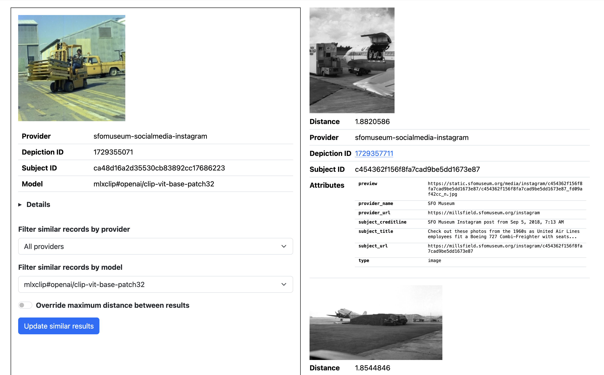
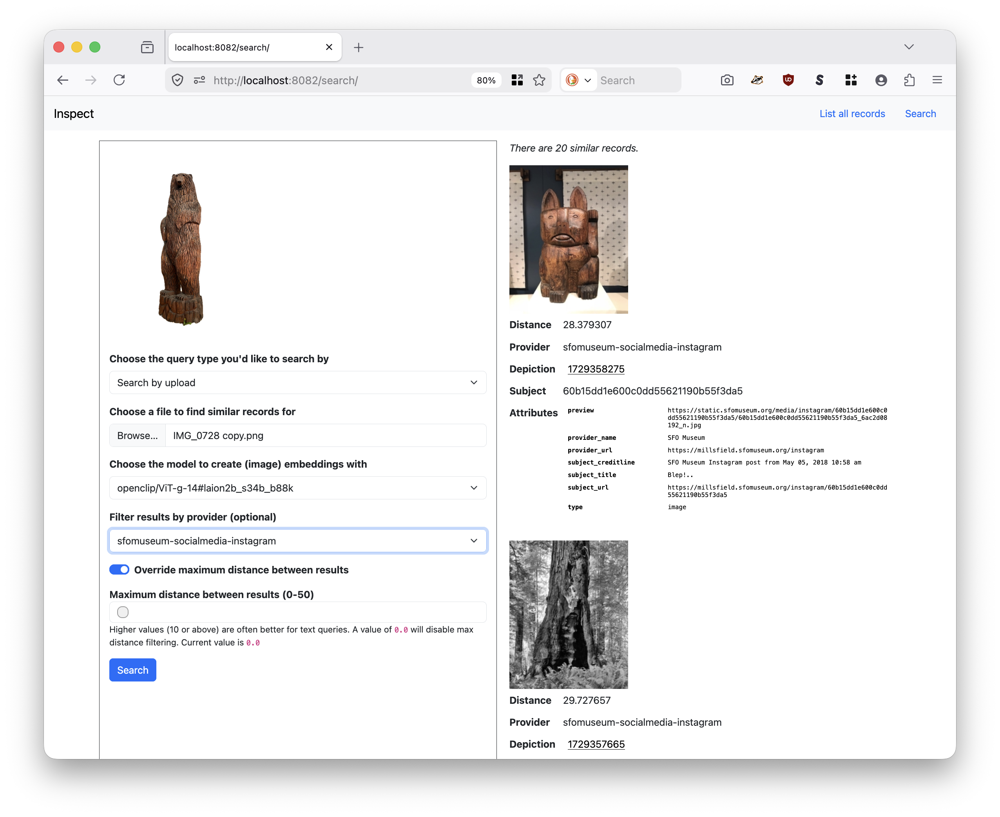
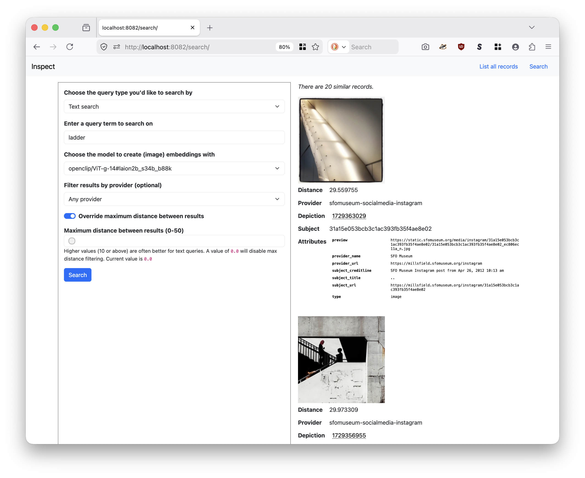

## embeddingsdb-inspector

A minimalist web-interface for inspecting documents stored in a `embeddingsdb-server` instance.

```
$> ./bin/embeddingsdb-inspector -h
A minimalist web-interface for inspecting documents stored in a `embeddingsdb-server` instance.
Usage:
	./bin/embeddingsdb-inspector [options]
Valid options are:
  -client-uri string
    	A validsfomuseum/go-embeddingsdb/client.Client URI. (default "grpc://localhost:8080")
  -embeddings-client-uri string
    	A registered go-embeddings.Client URI. This is required if the -enable-search flag is true.
  -enable-search
    	Enable search functionality.
  -max-results int
    	The maximum number of similar results to return. (default 20)
  -max-upload-size int
    	The maximum size (in bytes) for uploads. (default 10485760)
  -server-uri string
    	A registered aaronland/go-http/v4/server.Server URI. (default "http://localhost:8080")
  -uri-prefix string
    	An optional prefix (location) to serve the application from.
  -verbose
    	Enable verbose (debug) logging.
```

For example:

```
$> make inspector
go run -tags=sqlite -mod vendor \
		cmd/inspector/main.go \
		-verbose \
		-client-uri 'grpc://localhost:8081' \
		-enable-search \
		-embeddings-client-uri 'mobileclip://?client-uri=grpc://localhost:8080' \
		-server-uri http://localhost:8082
2026/03/30 12:42:01 DEBUG Verbose logging enabled
2026/03/30 12:42:01 DEBUG Allow insecure connections
2026/03/30 12:42:01 INFO Listen for requests address=http://localhost:8082
```

Opening your web browser to `http://localhost:8082` you would see something like this (depending on the records you've indexed in the `embeddingsdb` databae):


You can filter the list view by model and by provider (the source of embeddings). As you can see the list view needs some loving to collapse similar depictions with multiple models in a single view. Soon, I hope.

Individual record pages look like this:



By default record pages will show similar records for a single model across all providers. Both of these facets may be updated. The left hand panel (the record being viewed) will remain fixed but the right hand panel (containing similar records) will scroll.

If enabled (with the `-enable-search` flag) there is also an endpoint where you can query for similar results by text or by uploading an image of your choosing, generate embeddings on the fly for that image and then use those data to search for similar images in the `embeddingsdb` database. For example:



As with the record view, the left hand panel (the image that was uploaded) will remain fixed but the right hand panel (containing similar records) will scroll. You can also search for images by text:



### Note and caveats

#### embeddingsdb-inspector is a client

Conceptually, the `embeddingsdb-inspector` is a _client_ (as described above) of an `embeddingsdb` database instance. That means one of two things:

1. You will need to have an `embeddingsdb` server instance running somewhere which will broker communications with the underlying database; for example the `grpc://localhost:8081` URI above.
2. You will need to specify a `database://` client URI appropriate to your setup; for example, to interact directly with a local DuckDB database your client URI would be something like `database://?database-uri=duckdb:///usr/local/data/embeddings`.

#### search 

In order for the search functionality to work you will need to instantiate an instance of the [sfomuseum/go-embeddings](https://github.com/sfomuseum/go-embeddings) `Client` interface. The `go-embeddingsdb` package only supports storing, indexing and querying vector embeddings. It does handle _creating_ them. This is handled by the `go-embeddings` package which supports [a number of different implementations](https://github.com/sfomuseum/go-embeddings?tab=readme-ov-file#implementations) for generating vector embeddings.

#### importing records

The `embeddingsdb-inspector` does not handle _importing_ records in to an `embeddingsdb` database. This is handled by separate processes like the [`parquet-import` tool](../parquet-import/README.md).

## Running the `embeddingsdb-inspector` as an AWS Lambda Function URL

It is possible to run the `embeddingsdb-inspector` from an AWS Lambda Function URL when using the [S3 Vectors database implementation](../database/README.md#s3vectors).

Note: This documentation assumes you have already added vector embeddings to an S3 Vectors bucket/index using the `parquet-import` tool or something like it. For example:

```
./bin/parquet-import \
	-client-uri 'database://?database-uri=s3vectors%3A%2F%2Fembeddings%3Fregion%3Dus-east-1%26credentials%3Dsession%26dimensions%3D512%26index%3Dembeddings-512' \
	-verbose
	https://static.sfomuseum.org/embeddings/20260414-sfomuseum-instagram.parquet
```

### Compiling

The first step is to compile the `embeddingsdb-inspector` application. The easiest way to do this is by running the `lambda-inspector` Makefile target at the root is this repository. For example:

```
$> cd /usr/local/src/go-embeddingsdb
$> make lambda-inspector
if test -f bootstrap; then rm -f bootstrap; fi
if test -f embeddingsdb-inspector.zip; then rm -f embeddingsdb-inspector.zip; fi
GOARCH=arm64 GOOS=linux go build -mod readonly -ldflags="-s -w" -tags no_duckdb,lambda.norpc -o bootstrap cmd/inspector/main.go
zip embeddingsdb-inspector.zip bootstrap
  adding: bootstrap (deflated 71%)
rm -f bootstrap
```

Note the use of the `no_duckdb` tag. This is important. Without it support for DuckDB will be assumed and this will introduce a universe of C-compiler problems.

Create your Lambda function and upload the `embeddingsdb-inspector.zip` as its code source. These details are out of scope for this document.

### Layers

Add the [AWS Lambda Web Adapter](https://github.com/aws/aws-lambda-web-adapter) to your Lambda function:

```
arn:aws:lambda:us-west-2:753240598075:layer:LambdaAdapterLayerArm64:20
```

Note that the Lambda Web Adapter is configured to work with applications serving requests from `localhost:8080` which is also the default for the `embeddingsdb-inspector`.

### Environment variables

Command line flags are inferred from AWS Lambda environment variables. The rules for mapping a command line flag to an environment variable are as follows:

* Upper-case the name of the flag.
* Replace all instances of "-" with "_".
* Prepend the environment variable with "INSPECTOR_".

For example the command line flag `client-uri` would become `INSPECTOR_CLIENT_URI`. The following envinronment variables are required.

| Key | Value | Notes |
| --- | --- | --- |
| INSPECTOR_CLIENT_URI | `database://?database-uri={DATABASE_URI}` | See notes below. |

When defining a client URI `{DATABASE_URI}` is expected to a URL-escaped value in the form of: s3vectors://{BUCKET_NAME}?region={AWS_REGION}&credentials=iam:&dimensions={DIMENSION}&index={INDEX_NAME}". For example:

```
database://?database-uri=s3vectors%3A%2F%2Fsfomuseum-embeddings%3Fregion%3Dus-east-1%26credentials%3Diam%3A%26dimensions%3D512%26index%3Dembeddings-512
```

### IAM Policy

Example IAM policies can be found in [the `s3vectors` database documentation](database/README/#s3vectors).

### Function URL

Create a new Function URL for your Lambda function. Whether or not you make this public, or require credentialed access, is left up to you.